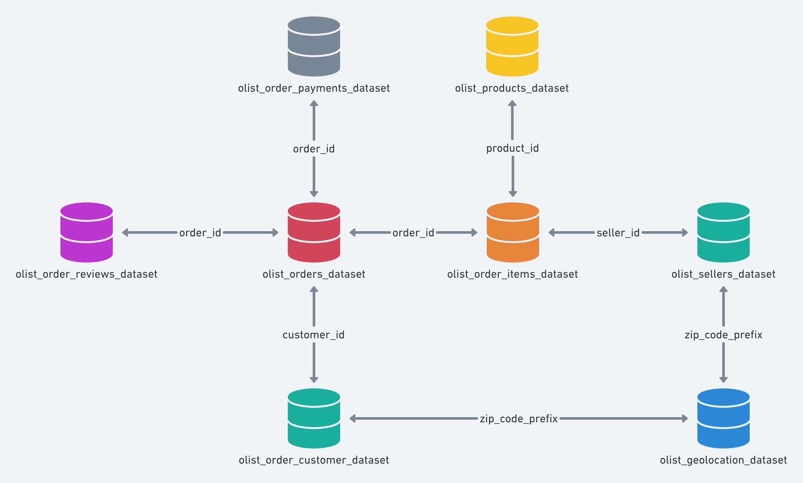

# DataSet de um E-commerce brasileiro
Esse repositório é um projeto básico de análise de dados sobre o DataSet da [_Olist Store_](https://www.olist.com/). 

## Sobre o DataSet

Possui informações de aproximadamente 100 _mil_ pedidos desde 2016 a 2018 realizados em inúmeros _marketplaces_ do Brasil. Suas características permitem a visão de muitas dimensões: desde status do pedido, preço, pagamento, frete até localização do cliente, atributos dos produtos e avaliações dos produtos escritas pelos usuários.

## Contexto

Esse conjunto de dados foi generosamente fornecido pela _Olist_, a maior loja de departamentos nacional. Olist conecta pequenas empresas de todo o Brasil com um único contrato. Esses comerciantes podem vender seus produtos através da Olist Store e enviá-los diretamente para os clientes usando parceiros de logística Olist. 

Depois que um cliente compra o produto da Olist Store, um vendedor é notificado para cumprir esse pedido. Uma vez que o cliente recebe o produto, ou a data de entrega estimada é cumprida, o cliente recebe uma pesquisa de satisfação por e-mail, onde ele pode dar uma nota para a experiência de compra e anotar alguns comentários.

### Atenção 
1. Uma ordem deve ter múltiplos itens;
2. Cada item pode ser preenchido por um vendedor distinto, isto é, um pedido pode ter vendedores de lojas diferentes;

## Esquema dos Dados

Os dados são divididos em várias tabelas para um melhor entendimento e organização, sendo que estão relacionados entre si de acordo com o seguinte esquema:  

  
  

     
    <b>Figura 1: </b> Data Schema
  

## Objetivos

Através desse dataset, meu objetivo inicial é realizar uma análise exploratória de dados para observar o desempenho de vendas de uma loja e-commerce e aprender mais sobre SQL, principalmente funções `JOINs` mais complexas. Perguntas interessantes que eu quero responder e consultar são:

1. Qual a receita total por categoria de produto? (Usando JOIN e GROUP BY)
2. Qual o ticket médio de compra por estado do cliente? (Usando JOIN e GROUP BY)
3. Quantos pedidos foram feitos por mês? (Usando a função DATE_FORMAT e GROUP BY)
4. Qual o tempo médio de entrega dos pedidos? (Calculando a diferença entre as datas de envio e de entrega)
5. Quais produtos receberam as melhores e piores avaliações? (Usando JOIN com a tabela de reviews e ORDER BY)

### Objetivos Futuros

Depois de realizar uma boa limpeza e fazer uma manipulação com esses dados, futuramente o objetivo é realizar análises mais complexas como _clustering_ (categorização para definir nível de felicidade com a compra) e _predição de vendas_ para obter informações de futuras vendas. 

## O que foi feito até agora

Baseado no esquema da [Figura 1](HRhd2Y0.png), realizou-se o seguinte mapeamento no 
