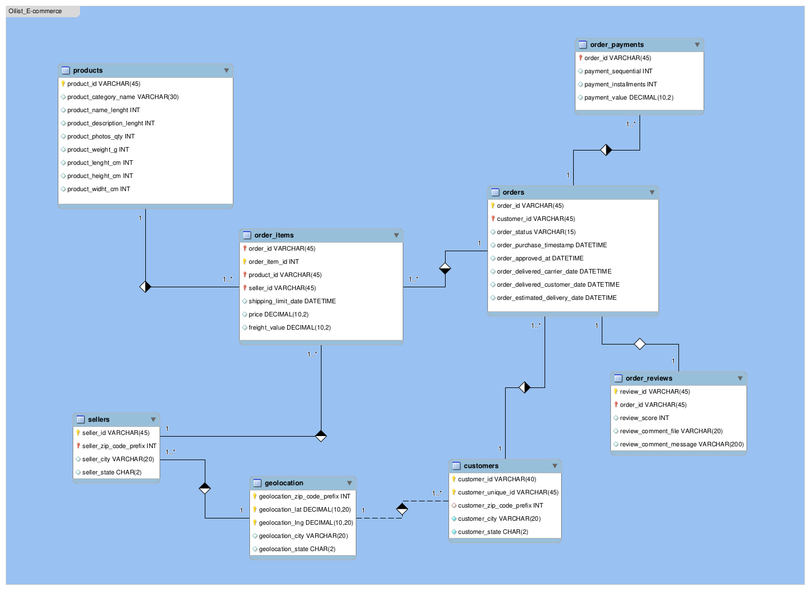

# DataSet de um E-commerce brasileiro
Esse repositório é um projeto básico de análise de dados sobre o DataSet da [_Olist Store_](https://www.olist.com/). 
> 🚧 Este README está em constante atualização à medida que o projeto avança.

## Sumário

- [Sobre o DataSet](#sobre-o-dataset)
- [Contexto](#contexto)
- [Esquema dos Dados](#esquema-dos-dados)
- [Objetivos](#objetivos)
- [Objetivos Futuros](#objetivos-futuros)
- [O que foi feito até agora](#o-que-foi-feito-até-agora)
- [Recursos](#recursos)

---

## Sobre o DataSet

Possui informações de aproximadamente **100 _mil_ pedidos** desde 2016 a 2018 realizados em inúmeros _marketplaces_ do Brasil. Suas características permitem a visão de muitas dimensões: desde status do pedido, preço, pagamento, frete até localização do cliente, atributos dos produtos e avaliações dos produtos escritas pelos usuários.

---
## Contexto

Esse conjunto de dados foi generosamente fornecido pela _Olist_, a maior loja de departamentos nacional. Olist conecta pequenas empresas de todo o Brasil com um único contrato. Esses comerciantes podem vender seus produtos através da Olist Store e enviá-los diretamente para os clientes usando parceiros de logística Olist. 

Depois que um cliente compra o produto da Olist Store, um vendedor é notificado para cumprir esse pedido. Uma vez que o cliente recebe o produto, ou a data de entrega estimada é cumprida, o cliente recebe uma pesquisa de satisfação por e-mail, onde ele pode dar uma nota para a experiência de compra e anotar alguns comentários.

---

## Atenção

> ⚠️ **Importante:**  
> - Uma ordem pode conter múltiplos itens.
> - Cada item pode ser atendido por um vendedor distinto, ou seja, um pedido pode envolver lojas diferentes.

---
## Esquema dos Dados

Os dados são divididos em várias tabelas para um melhor entendimento e organização, sendo que estão relacionados entre si de acordo com o seguinte esquema:  

  
  

     
    <b>Figura 1: </b> Data Schema
  

## Objetivos

Através desse dataset, meu objetivo inicial é realizar uma **análise exploratória de dados (_EDA_)** para observar o desempenho de vendas de uma loja e-commerce e aprender mais sobre SQL, principalmente funções `JOINs` mais complexas. Perguntas interessantes que eu quero responder e consultar são:

1. Qual o ticket médio de compra por estado do cliente? (Usando JOIN e GROUP BY)
2. Quantos pedidos foram feitos por mês? (Usando a função DATE_FORMAT e GROUP BY)
3. Qual o tempo médio de entrega dos pedidos? (Calculando a diferença entre as datas de envio e de entrega)
4. Quais produtos receberam as melhores e piores avaliações? (Usando JOIN com a tabela de reviews e ORDER BY)

  
<strong>Objetivos Futuros</strong>

  Após a etapa inicial de limpeza e manipulação dos dados, os próximos passos incluem:

  - Análises avançadas, como _clustering_ (agrupamento de clientes, produtos ou vendedores)
  - Criação de dashboards interativos
  - Aplicação de métodos de machine learning para previsão de vendas e churn
  - Otimização de processos logísticos com base nos dados coletados

## O que foi feito até agora

Baseado no esquema da [Figura 1](HRhd2Y0.png), realizou-se o mapeamento da [Figura 2](Olist_ecommerce.png) no [_MySQL Workbench_](https://www.mysql.com/products/workbench/): 

  
  

     
    <b>Figura 2: </b> Esquema Workbench
  

O esquema conceitual foi implementado em [_SQL_](tables.sql), com ajustes nos tipos de dados dos atributos e as tabelas foram [populadas](insert_into_tables.sql) com os arquivos _.csv_ do DataSet. 

A partir disso, responderam-se as questões propostas: 
1. "Qual o ticket médio de compra por estado?"
Primeiro eu quis estabelecer uma relação entre a quantidade de vendas por Estado e depois comparar com a média de compra em cada estado de acordo com o total da compra (Peço + Frete).

## Recursos

- [tables.sql](tables.sql): Esquema do banco de dados em SQL
- [Olist Store - Dataset original (Kaggle)](https://www.kaggle.com/datasets/olistbr/brazilian-ecommerce)
- [MySQL Workbench](https://www.mysql.com/products/workbench/)

---
